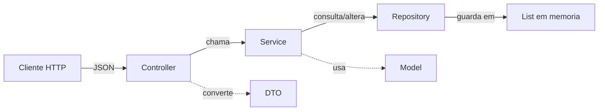

# Sistema Família — Apresentação dos Projetos

Este repositório foi desenvolvido por **Vitor Cardoso** e reúne dois projetos Java que implementam o **mesmo domínio de negócio** — gestão patrimonial de uma família — em duas abordagens progressivas. A proposta é partir de um programa simples no terminal e evoluir até uma API REST com Spring Boot, mostrando como as mesmas regras de negócio se reorganizam conforme a arquitetura muda.

---

## O que estes projetos simulam?

Imagine uma família com membros cadastrados, cada um com carteira (dinheiro disponível) e possíveis dívidas. Essa família possui **bens**: animais de estimação, casas e carros. O sistema permite:

- Cadastrar pessoas e bens
- Vincular bens a proprietários
- Transferir bens entre membros (com ou sem transação financeira)
- Calcular o **patrimônio líquido** de cada pessoa: valor dos bens + carteira − dívida

Não é um sistema bancário real, mas um **ecossistema patrimonial familiar** pensado para ensinar conceitos de POO e, depois, arquitetura de APIs.

---

## Visão geral do repositório

```
SistemaIntegracaoJava/
├── sistema-familia/        → Aplicação console (Java puro + Maven)
└── sistema-familia-api/    → API REST (Spring Boot 3 + Maven)
```

| Aspecto | Console | API |
|---|---|---|
| **Interação** | Menu no terminal | Requisições HTTP com JSON |
| **Framework** | Nenhum (Java puro) | Spring Boot 3 |
| **Armazenamento** | `ArrayList` locais | Repositories em memória |
| **Lógica de negócio** | `GestorPatrimonio` (métodos estáticos) | Services (`@Service`) |
| **Validação** | `if` manual | Jakarta Validation |
| **Erros** | Mensagens no console | JSON padronizado com HTTP status |

**Pré-requisitos:** JDK 17+ e Maven 3.6+.

---

## Projeto 1: `sistema-familia` — Aplicação Console

### Propósito

Ponto de partida da trilha. Um programa Java que roda no terminal, sem dependências externas além da biblioteca padrão (`ArrayList`, `Scanner`). O foco é **Programação Orientada a Objetos**: encapsulamento, composição de objetos e regras de negócio dentro dos métodos das classes.

### Como executar

```bash
cd sistema-familia
mvn exec:java
```

### Estrutura do código

```
com.vitorcardoso.familia/
├── Main.java              → Entrada do programa e menu interativo
├── Pessoa.java            → Membros da família (carteira, dívida)
├── Animal.java            → Animais de estimação (sem valor monetário)
├── Casa.java              → Imóveis (com valor)
├── Carro.java             → Veículos (com valor)
└── GestorPatrimonio.java  → Lógica de transferências e finanças
```

### O modelo de domínio

O coração do sistema são quatro entidades relacionadas:

```
                  ┌──────────────┐
                  │    Pessoa    │
                  │ nome, idade  │
                  │ parentesco   │
                  │ carteira     │
                  │ divida       │
                  └──────┬───────┘
                         │ 1
              ┌──────────┼──────────┬──────────────┐
              │ 0..*     │ 0..*     │ 0..*         │
        ┌─────▼────┐ ┌───▼─────┐ ┌──▼──────┐
        │  Animal  │ │  Casa   │ │  Carro  │
        │ (sem $)  │ │ (valor) │ │ (valor) │
        └──────────┘ └─────────┘ └─────────┘
```

Cada bem referencia uma `Pessoa` como dono (ou `null` se estiver sem proprietário). Uma pessoa pode possuir vários bens.

A classe `Pessoa` concentra as operações financeiras:

- `creditar()` / `debitar()` — movimentação da carteira
- `aumentarDivida()` — registra empréstimo
- `pagarDivida()` — quita parcial ou totalmente, respeitando o limite entre dívida e carteira
- `podeSerProprietarioDeBemImovelOuVeiculo()` — retorna `true` se idade ≥ 18

### O menu interativo

Ao iniciar, o usuário vê um menu com 15 opções agrupadas em quatro blocos:

| Bloco | Opções | O que faz |
|---|---|---|
| **Cadastros** | 1–4 | Criar pessoa, animal, casa ou carro |
| **Consultas** | 5–9 | Listar registros e ver patrimônio |
| **Propriedade** | 10–13 | Atribuir dono ou transferir bens |
| **Financeiro** | 14–15 | Pagar dívida ou sair |

O `Main.java` mantém um loop `while(continuar)` com `if/else` para cada opção. As listas `familia`, `animais`, `casas` e `carros` vivem dentro do `main()` — são a "memória" do programa enquanto ele está rodando.

### Regras de negócio principais

1. **Maioridade para imóveis e veículos** — só quem tem 18 anos ou mais pode ser dono de casa ou carro.
2. **Animais sem restrição de idade** — qualquer membro cadastrado pode ser dono.
3. **Venda com empréstimo automático** — ao transferir casa ou carro, se o comprador não tem saldo suficiente, o sistema oferece um empréstimo **sem juros** para cobrir a diferença. O vendedor sempre recebe o valor cheio.
4. **Transferência de animal é gratuita** — apenas troca o dono, sem movimentação financeira.
5. **Atribuir proprietário** (opção 10) — regulariza a titularidade **sem custo**, diferente da transferência com venda.

### Fluxo emblemático: venda de casa com empréstimo

```
Pai (carteira: R$ 5.000) possui Casa de praia (R$ 200.000)
Filho (carteira: R$ 1.000) quer comprar

→ Saldo insuficiente: faltam R$ 199.000
→ Sistema pergunta: "Aceita emprestimo sem juros?"
→ Filho confirma
→ Resultado:
   • Filho: carteira R$ 0, dívida R$ 199.000, dono da casa
   • Pai:   carteira R$ 205.000 (recebeu os R$ 200.000)
```

Esse fluxo vive no método privado `executarVenda()` dentro de `GestorPatrimonio`, reutilizado por `transferirCasa()` e `transferirCarro()`.

---

## Projeto 2: `sistema-familia-api` — API REST

### Propósito

Evolução natural do console. **As mesmas regras de negócio**, agora servidas via HTTP com Spring Boot 3. Cada opção do menu virou um endpoint REST; a interação pelo terminal foi substituída por payloads JSON.

O foco didático passa a ser **arquitetura em camadas**: Controller → Service → Repository, DTOs, validação declarativa, tratamento de erros padronizado e documentação via Swagger UI.

### Como executar

```bash
cd sistema-familia-api
mvn spring-boot:run
```

A API sobe em `http://localhost:8080/api`. Documentação interativa em:

```
http://localhost:8080/api/swagger-ui.html
```

### Arquitetura em camadas



| Camada | Responsabilidade | Substitui no console |
|---|---|---|
| **Controller** | Recebe HTTP, valida payload, devolve JSON | Loop do menu + `if/else` do `Main.java` |
| **Service** | Regras de negócio | `GestorPatrimonio` |
| **Repository** | Persistência em memória (singleton) | `ArrayList` locais do `main()` |
| **Model** | Entidades de domínio | Mesmas classes + `id` + atributos `private` |
| **DTO** | Objetos de entrada (`*Request`) e saída (`*Response`) | `System.out.println` / leitura via `Scanner` |
| **Exception** | Erros padronizados em JSON | Mensagens impressas no console |

### Do menu ao endpoint

Cada opção do console tem um equivalente REST:

| Menu | Método | Endpoint |
|---|---|---|
| Cadastrar pessoa | `POST` | `/pessoas` |
| Cadastrar animal | `POST` | `/animais` |
| Cadastrar casa | `POST` | `/casas` |
| Cadastrar carro | `POST` | `/carros` |
| Listar família | `GET` | `/pessoas` |
| Ver patrimônio | `GET` | `/pessoas/{id}/patrimonio` |
| Atribuir proprietário | `PUT` | `/{recurso}/{id}/dono` |
| Transferir casa/carro | `POST` | `/{recurso}/{id}/transferencia` |
| Transferir animal | `POST` | `/animais/{id}/transferencia` |
| Pagar dívida | `POST` | `/pessoas/{id}/pagamento-divida` |

### Como a interatividade vira JSON

No console, `executarVenda()` fazia perguntas sequenciais no terminal. Em REST não há conversa — tudo vai no corpo da requisição:

```json
{
  "novoDonoId": 3,
  "aceitaEmprestimo": true
}
```

- Se o comprador tem saldo total → `aceitaEmprestimo` é ignorado (venda à vista).
- Se falta dinheiro e `aceitaEmprestimo: false` → resposta `422` com mensagem explicativa.
- Se falta dinheiro e `aceitaEmprestimo: true` → mesma lógica do console: debita carteira, soma dívida, credita vendedor.

A confirmação "S/N" do terminal **desaparece** — o próprio envio da requisição HTTP já é a confirmação da ação.

### Tratamento de erros

Erros viram JSON estruturado via `GlobalExceptionHandler`:

```json
{
  "timestamp": "2026-06-29T20:15:33.123",
  "status": 422,
  "erro": "Regra de negocio violada",
  "mensagem": "Saldo insuficiente: faltam R$ 199000,00..."
}
```

| Código HTTP | Quando |
|---|---|
| `400` | Payload inválido (`@NotBlank`, `@Positive`, etc.) |
| `404` | ID não encontrado |
| `422` | Regra de negócio violada (menor de idade, mesmo dono, saldo insuficiente…) |
| `500` | Erro inesperado |

---

## A jornada de evolução: do console à API

O grande valor deste repositório está em **rastrear onde cada pedaço do código antigo foi parar**:

| Console | API |
|---|---|
| `Main.java` (loop + menu) | Controllers (`PessoaController`, `CasaController`, etc.) |
| `ArrayList` no `main()` | Repositories singleton |
| `GestorPatrimonio` (static) | `GestorPatrimonioService` (`@Service`) |
| `Pessoa#exibirDados()` | `PessoaResponse.from(...)` |
| `Pessoa#exibirPatrimonio()` | `PessoaService#calcularPatrimonio()` → `PatrimonioResponse` |
| `confirmarAcao("S/N")` | Removido — requisição HTTP = confirmação |
| `if (nome.isBlank())` | `@NotBlank` nos DTOs |
| `System.out.println("inválido")` | `throw new BusinessException(...)` |

A lógica de `executarVenda()` permanece essencialmente a mesma — o que muda é o **canal de comunicação** (terminal → HTTP) e a **organização do código** (monolito procedural → camadas com responsabilidades separadas).

---

## Ordem de estudo recomendada

1. **Execute o console** (`sistema-familia`) e explore todas as opções do menu para internalizar as regras de negócio sem a complexidade de um framework.
2. **Compare** `GestorPatrimonio.java` com `GestorPatrimonioService.java` — a lógica é a mesma; note o que foi removido (`Scanner`, `System.out`) e o que foi adicionado (injeção de dependência, exceções tipadas).
3. **Suba a API** e reproduza os mesmos fluxos via Swagger UI ou cURL.
4. **Consulte a tabela de mapeamento** no README da API para localizar cada trecho do console no novo projeto.

---

## Próximos passos sugeridos

Para quem quiser continuar evoluindo:

- Adicionar endpoints de edição e remoção (`PUT`, `DELETE`)
- Trocar listas em memória por **Spring Data JPA + H2** (persistência entre execuções)
- Escrever testes com `@SpringBootTest` (especialmente para `executarVenda`)
- Adicionar autenticação com Spring Security
- Versionar a API (`/api/v1/...`)

No console, melhorias como superclasse abstrata `Bem`, persistência em arquivo e testes unitários com JUnit também são caminhos naturais.

---

## Conclusão

Os projetos **Sistema Família** formam uma trilha didática completa: do Java puro com POO até uma API REST profissional com Spring Boot. O domínio é simples o suficiente para ser compreendido rapidamente, mas rico o bastante para demonstrar cadastro, relacionamentos, regras de negócio, transações financeiras simuladas e evolução arquitetural.

A mensagem central é esta: **as regras de negócio não mudam quando você troca console por API** — o que muda é como você organiza, expõe e valida essas regras. Dominar essa transição é um dos passos mais importantes na formação de um desenvolvedor backend.

---

*Projeto educacional desenvolvido por Vitor Cardoso.*
